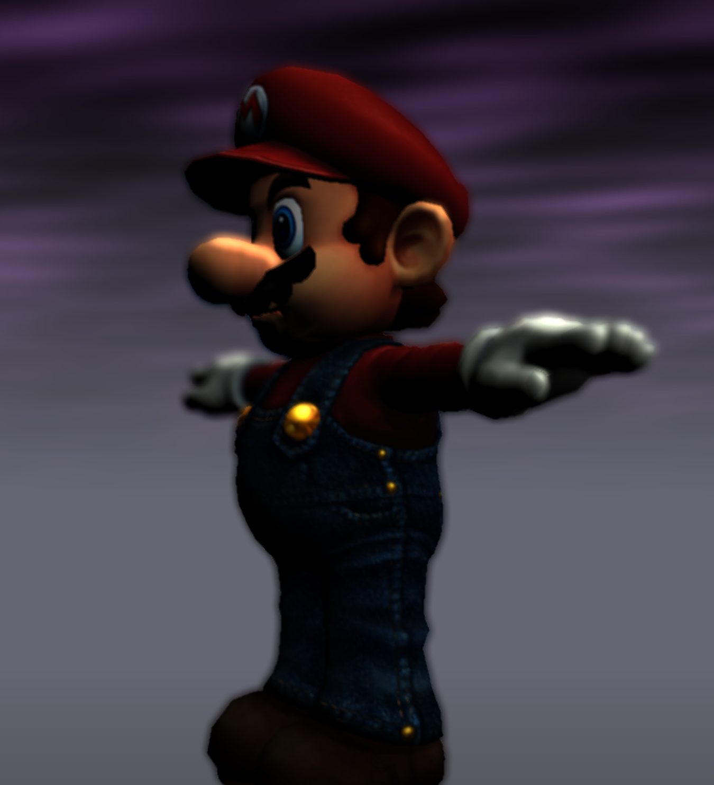

# Project 7: Deferred Renderer - Joshua Nadel

https://github.com/BobMowzie/homework-7-deferred-renderer-BobMowzie-forked.git

My deferred rendering pipeline uses GBuffers to pass information from a standard shader, to a deferred rendering shader, to a number of post-processing shaders. With this pipeline, I can achieve a number of interesting effects.

# Bloom

Bloom utilizes two shader passes. The first selects pixels above a certain luminance threshhold, and the second blurs these pixels and adds them to the original image. The second shader takes two inputs: the original image and the highpass selected image.

# Depth of Field

Depth of field takes the scene depth calculated from the standard shader and uses it to determine the intensity of the blur effect.

# Sketch

My sketch effect utilizes a combination of cell shading, noise generation, and sobel filtering to achieve an interesting result. Pixel colors are rounded to certain steps to achieve areas of pixels of the same value. Lines are generated accross the screen with variable frequency according to pixel value. These lines are distorted using two layers of noise. Black areas are left black, and white areas are left white.

# Tone Mapping

My tone mapping shader implements a simple Reinhard operator described here: http://filmicworlds.com/blog/filmic-tonemapping-operators/.